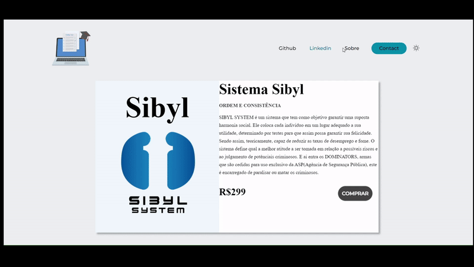

# Nav Bar and Dark/White Theme
My first experience with HTML,CSS and JS.In this first project I wanted to create an elegant Nav Bar and use JS to create a dark and light theme on the website.  

   
   

  
